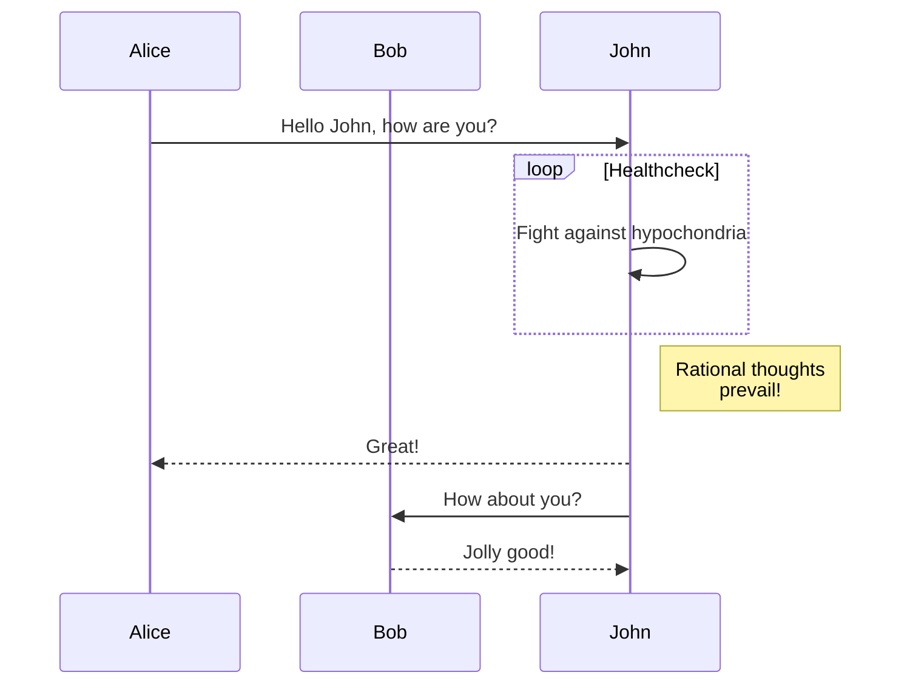
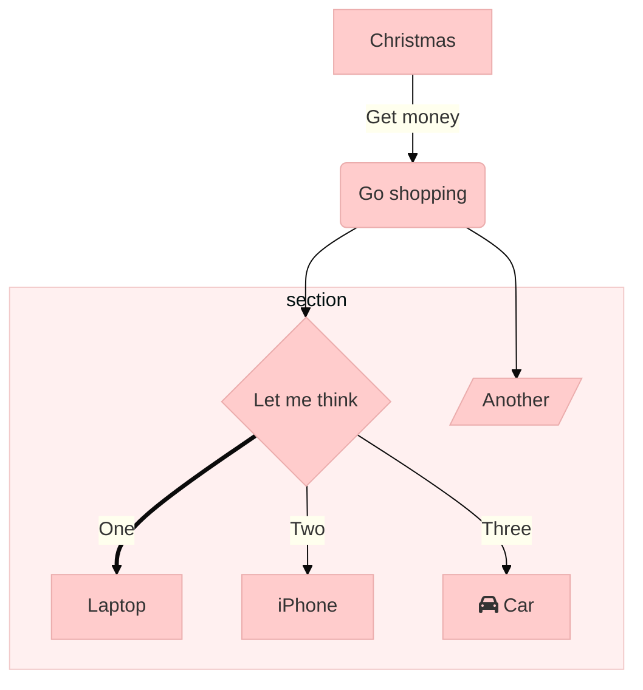

# I made a Blog

Weird isn't it; it seems kina low on the priority list. But it has a purpose: document all the things
<!--more-->

## Maths testing

This is still in progress; and below is one such test; Maths

Lift($L$) can be determined by Lift Coefficient ($C_L$) like the following
equation.

$$ L = \frac{1}{2} \rho v^2 S C_L $$

Integrated maths utilities are helpful for explaining mathsy things; but so are integrated diagrams useful too:

## Mermaid Testing

If the blog is working correctly you should see a rendered [mermaid.js](https://mermaid-js.github.io/mermaid/#/) diagram rendered. This is work in progress because pre-rendering them is kinda broken due to poorly designed software stacks

### Another graph

This is a test of inline graph styling, which currently doesn't work:

See [here](https://mermaid-js.github.io/mermaid/#/theming) for how it should look

## GFM + Github testing

~~This doesn't work yet :/~~

It works now; Issue was versioning :/

| foo | bar |
| --- | --- |
| baz | bim |
| baz | bim |
| baz | bim |

Github style syntax now also works: #10