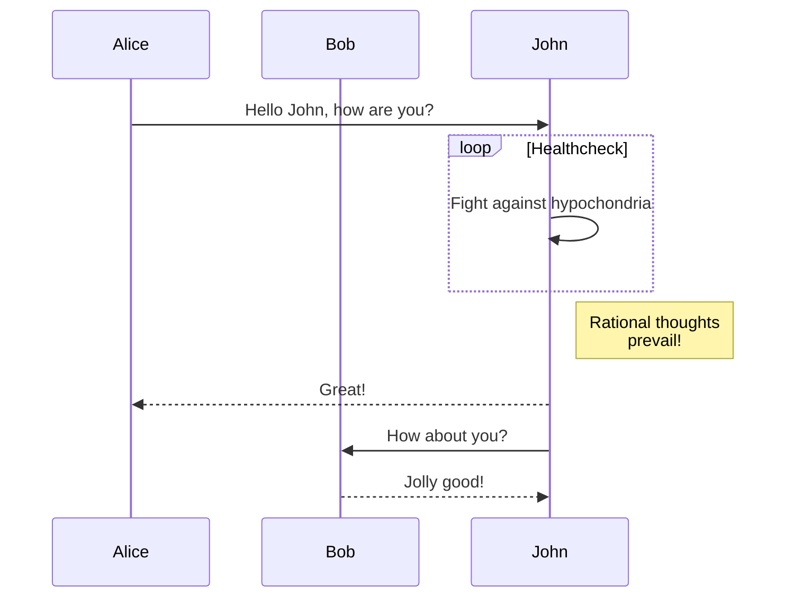

# I made a Blog

Weird isn't it; it seems kina low on the priority list. But it has a purpose
<!--more-->

This is still in progress; and below is one such test

Lift($L$) can be determined by Lift Coefficient ($C_L$) like the following
equation.

$$
L = \frac{1}{2} \rho v^2 S C_L
$$

